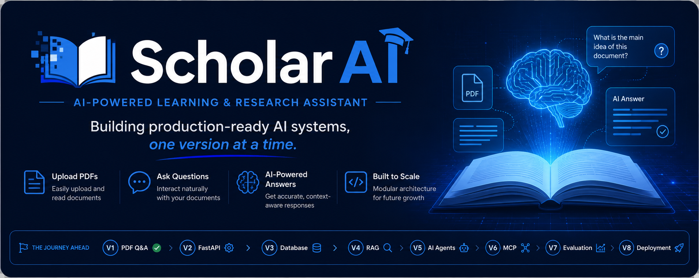
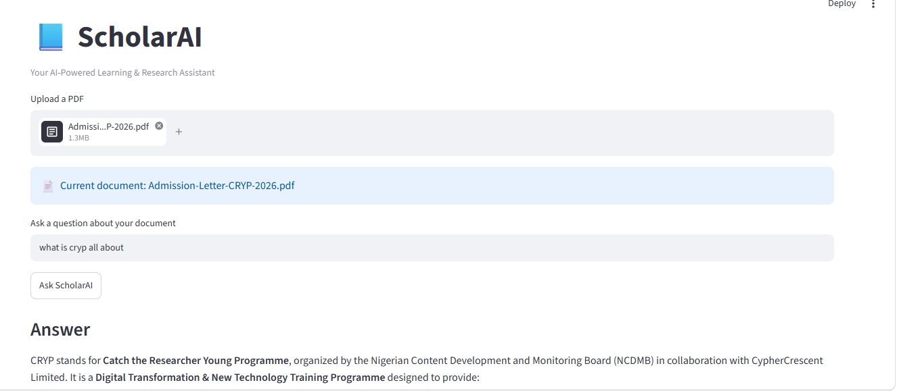

<p align="center">
  
</p>

# 📘 ScholarAI

> **Building production-ready AI systems, one version at a time.**

ScholarAI is an AI-powered learning and research assistant that I'm building from scratch as part of my AI engineering journey.

Rather than building one large application all at once, I'm developing ScholarAI incrementally. Each version introduces **exactly one new AI engineering concept** while maintaining clean architecture and production-oriented design. By the end of the project, ScholarAI will evolve from a simple PDF Question & Answer application into a complete AI-powered learning and research platform.

This project serves two purposes:

* 🎓 A tool to support my final-year research and learning.
* 🚀 A long-term portfolio project documenting my growth as an AI Engineer.

---

# 📸 Demo

## Version 1 — PDF Question & Answer

<p align="center">
  
</p>

Upload a PDF, ask questions about its contents, and receive AI-generated answers powered by a Large Language Model.

---

# ✨ Features

### Version 1

* 📄 Upload a PDF document
* 🤖 Ask questions about the uploaded document
* 🧠 Receive AI-generated answers based on the document
* ⚡ Model-agnostic LLM integration via OpenRouter
* 💾 Efficient document handling with Streamlit Session State
* 🏗 Modular architecture designed for future expansion

---

# 🛠 Tech Stack

| Category       | Technology        |
| -------------- | ----------------- |
| Language       | Python 3.11       |
| Frontend       | Streamlit         |
| LLM Provider   | OpenRouter        |
| LLM SDK        | OpenAI Python SDK |
| PDF Processing | PyPDF             |
| Environment    | uv                |

---

# 📂 Project Structure

```text
ScholarAI/
│
├── assets/
│   ├── banner.png
│   └── screenshot-v1.png
│
├── documents/
│
├── src/
│   ├── __init__.py
│   ├── config.py
│   ├── llm.py
│   ├── pdf_loader.py
│   └── prompts.py
│
├── tests/
│
├── app.py
├── README.md
├── .env.example
├── .gitignore
├── pyproject.toml
└── uv.lock
```

---

# 🚀 Getting Started

## 1. Clone the repository

```bash
git clone https://github.com/AdebankeDev/ScholarAI.git
cd ScholarAI
```

## 2. Create a virtual environment

```bash
uv venv
```

## 3. Install dependencies

```bash
uv sync
```

## 4. Configure environment variables

Create a `.env` file in the project root.

```env
OPENROUTER_API_KEY=your_api_key_here
OPENROUTER_BASE_URL=https://openrouter.ai/api/v1
MODEL_NAME=your_preferred_model
```

You can use any OpenRouter-supported model without changing the application code.

## 5. Run ScholarAI

```bash
streamlit run app.py
```

---

# 🗺️ Development Roadmap

ScholarAI is intentionally built one version at a time.

| Version | AI Engineering Concept               | Status      |
| ------- | ------------------------------------ | ----------- |
| V1      | PDF Question & Answer                | ✅ Completed |
| V2      | FastAPI Backend                      | ⏳ Planned   |
| V3      | Database Integration                 | ⏳ Planned   |
| V4      | Retrieval-Augmented Generation (RAG) | ⏳ Planned   |
| V5      | AI Agents                            | ⏳ Planned   |
| V6      | Model Context Protocol (MCP)         | ⏳ Planned   |
| V7      | Evaluation & Monitoring              | ⏳ Planned   |
| V8      | Deployment                           | ⏳ Planned   |

---

# 🎯 Why I'm Building ScholarAI

Most AI tutorials focus on getting an application to work. My goal is different.

I'm using ScholarAI as a long-term engineering project to learn how production AI systems are designed, built, and maintained. Instead of copying tutorials, I'm gradually introducing new concepts while continuously improving the architecture.

By the end of this journey, ScholarAI will be:

* A practical learning and research assistant.
* A production-style AI application.
* A portfolio project showcasing my growth as an AI Engineer.

---

# 📈 Project Philosophy

This project follows three simple principles:

* **One new engineering concept per version.**
* **Keep the architecture clean and scalable.**
* **Build something useful while learning.**

---

# 👩🏽‍💻 About Me

Hi, I'm **Adebanke Peke**, a Computer Engineering student with a passion for Artificial Intelligence and AI Engineering.

I'm documenting my journey by building real AI applications that solve practical problems while helping me develop production-ready engineering skills.

If you have feedback, suggestions, or ideas for improving ScholarAI, I'd love to hear from you.

---

## ⭐ Support the Project

If you found this project interesting or helpful, consider giving it a ⭐ on GitHub.

Every version of ScholarAI represents another step in my journey toward becoming an AI Engineer.
